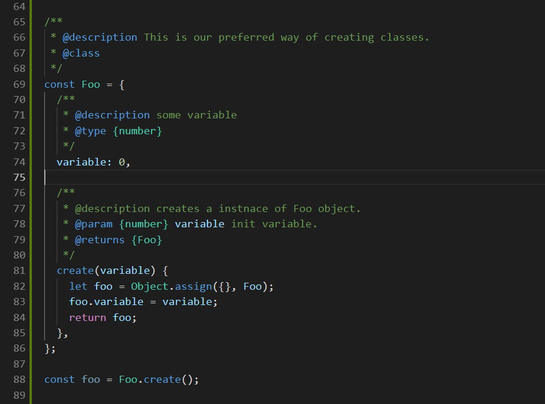

# js-syntax README

If it looks like a file is being generated incorrectly check the log file and file an issue on Github.

Provide syntax highlighting for scenarios we encounter a lot in our codebase. This allows us to easily know what is going on in a file
and avoid errors with naming. Things like proptypes and defaultProps gets used very often so its a good idea to have syntax highlighting for
these keywords.

The is also many ways to create a class in JavaScript since there is not such thing as a class only objects. We like to use Object literals
and take advantage of the builtin Object.create and Object.assign functions to create classes from the Object literals.

### Other Extensions:
- JS/React Snippet Extension

# Features

## Compile .js file into .ts file automagically. Read below to use!

You can call the command "Compile js file into ts file" or turn generateTypings setting to true.

The .ts file will be placed into the typings folder in your root directory. This is here vscode looks for typings.
- You need to have a jsconfig or tsconfig for vscode to pick up your typings automatically.
- The autocompile is sensitive to tab size. It picks up your tab size from editor.tabSize.
- You have to use Stroustrup or Allman style brackets.
### Make sure you set your @type tag corrrectly.
- We will generate a interface like {classname}Type. Add @type {{classname}Type} to the object literal.

### Auto Compile


### Maintain Hierarchy


### Highlight Foo.create() like new Foo().


### Code highlighting for comments with issues in them. A comment with an issue contains a #[0-9]


### Highlighting our way of creating classes.



### React & Next


# Change Color

### Change the color using these in your settings

``` json
"editor.tokenColorCustomizations": {
    "textMateRules": [
        {
            "scope": "comment.todo",
            "settings": {
                "foreground": "#EE82EE"
            }
        },
        {
            "scope": "comment.issue",
            "settings": {
                "foreground": "#5555EE"
            }
        },
        {
            "scope": "variable.react",
            "settings": {
                "foreground": "#9370DB"
            }
        },
        {
            "scope": "variable.next",
            "settings": {
                "foreground": "#9370DB"
            }
        }
    ]
},
```

## All Scopes

- comment.issue
- comment.todo
- variable.next
- variable.react
- keyword.create

## Settings

``` json
{
  "lgd.options": {
    "generateTypings": true,
    "generateTypingsOnChange": true,
    "maintainHierarchy": true,
    "createDebugLog": true
  }
}
```

## Goals for 2019

- Auto Compile whole project into typings folder.
- Auto Compile React Class.
- AutoComplete for React Proptypes.
- Classes with Type at the end need to show as error.

## Known Issues

~~Everything is thrown in the typings folder.~~
~~We need to add option to keep directory structure in typings folder.~~

Manual Adding of Class type.

## Release Notes

## V2

### 2.2.0 - 2.2.1

- Added the ability to compile on change.
- Improved Error reporting. Specify exact line error and warnings occur on for you to easily fix.
- Logging Errors that occure that aren't breaking to a log file in typings folder.

### 2.1.1 - 2.1.5

- Added maintainHierarchy to settings.
- Improved parsing of create method.

### 2.1.0

- Compile to js to ts now working with inline array.
- Add static keyword.
- Problems being shown for you to fix.
- Create method being parsed for non static variables.

### 2.0.5 - 2.0.6

- Command works now even if you dont have generateTypings set.
- Fixed typed file. interface needs to have a different name than the object for vscode to pick up.

### 2.0.3 - 2.0.4

- Add async and prevent breaking on nested functions
- Add ability to parse defaultValue in function paramaters.

### 2.0.0 - 2.0.2

- Compile a js file into a .d.ts file.
  - This will allow you to have intellisense throughout the whole project.
  - Activate auto compile with settings.

## V1

### 1.1.3 - 1.1.5

- Add highlighting for react keywords. proptypes, and defaultProptypes.
- Add highlighting for next keyword. getInitialProps.

### 1.1.1 - 1.1.2

- Fixed bug where create whould highlight in object literal comments.

### 1.1.0

- Added assign highlighting like create
- Treating Capital Object Literals like a class.

### 1.0.3 - 1.0.6

- Added TODO syntax highlight.
  - scopename: comment.todo.js
- Added Issue comment highlight.
  - scopename: comment.issue.js

### 1.0.0-1.02

Initial release
- Added foo.create syntax highlighting.
