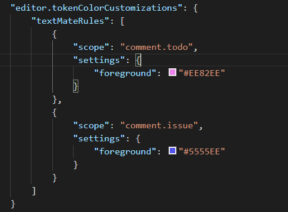

# js-syntax README

Provide syntax highlighting for scenarios we encounter a lot in our codebase. This allows us to easily know what is going on in a file
and avoid errors with naming. Things like proptypes and defaultProps gets used very often so its a good idea to have syntax highlighting for
these keywords. 

The is also many ways to create a class in JavaScript since there is not such thing as a class only objects. We like to use Object literals 
and take advantage of the builtin Object.create and Object.assign functions to create classes from the Object literals.

### Other Extensions:
- JS/React Snippet Extension

# Features

## Compile .js file into .ts file automagically.

The .ts file will be placed into the typings folder in your root directory. This is here vscode looks for typings. 
- Add compilerOptions.checkJs = true to your jsconfig.json or allowJs in tsconfig.json
- The autocompile is sensitive to tab size. It picks up your tab size from editor.tabSize.
- You have to use Stroustrup or Allman style brackets.

### Highlight Foo.create() like new Foo(). 

### Code highlighting for comments with issues in them. A comment with an issue contains a #[0-9]

### Highlighting our way of creating classes.

### React & Next

# Change Color

### Change the color using these in your settings

## All Scopes

- comment.issue
- comment.todo
- variable.next
- variable.react
- keyword.create

## Settings

Automatically enerate type file using this setting. You can all call the command, lgd.generateTypings.

`
lgd.options = {
  generateTypings: true
}
`

## Requirements

None

## Known Issues

None

## Release Notes

### 2.0.3 - 2.0.4

- Add async and prevent breaking on nested functions
- Add ability to parse defaultValue in function paramaters.

### 2.0.0 - 2.0.2

- Compile a js file into a .d.ts file. 
  - This will allow you to have intellisense throughout the whole project.
  - Activate auto compile with settings.

### 1.1.3 - 1.1.5

- Add highlighting for react keywords. proptypes, and defaultProptypes.
- Add highlighting for next keyword. getInitialProps.

### 1.1.1 - 1.1.2

- Fixed bug where create whould highlight in object literal comments.

### 1.1.0

- Added assign highlighting like create
- Treating Capital Object Literals like a class.

### 1.0.3 - 1.0.6

- Added TODO syntax highlight.
  - scopename: comment.todo.js
- Added Issue comment highlight.
  - scopename: comment.issue.js

### 1.0.0-1.02

Initial release
- Added foo.create syntax highlighting.
