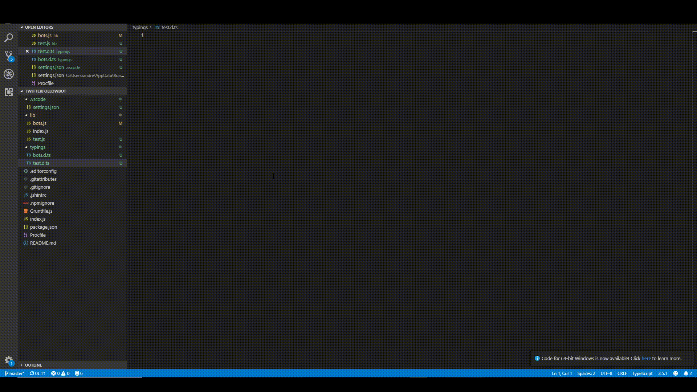
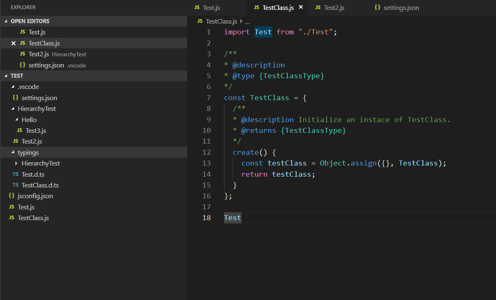
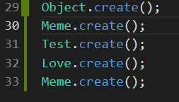
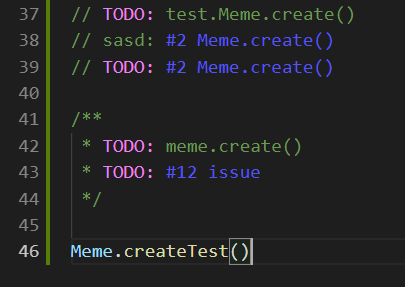
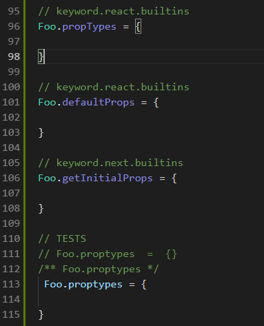

# JS to TS typings Compiler and JS Syntax Highlighter.

[](https://marketplace.visualstudio.com/items?itemName=learn-game-development.js-syntax-extension)
[](https://marketplace.visualstudio.com/items?itemName=learn-game-development.js-syntax-extension)
[](https://marketplace.visualstudio.com/items?itemName=learn-game-development.js-syntax-extension)


[](https://github.com/Andrew199617/js-syntax-extension/actions/workflows/tests.yml)

### Use Cases:

- Use typescript checking without needing to convert js files. We don't currently allow you to switch to TS using the extension. This extension is for better autocomplete, type checking, and more using JSDocs.
- Need improved intellisense for JavaScript? You will be able to leverage the typings folder and be able to more easily access types from other classes. This is a huge productivity boost!
- Create Types folder for a NPM module in seconds.
- Maintain OLOO pattern. Using Oloo is optional, you can use functions, classes, or Objects linked to other objects.
- This extension is for someone who prefers using vanilla Javascript with jsdoc over TypeScript.

### Have Issues?
- If it looks like a file is being generated incorrectly check the log file and file an issue on Github. This has high priority for me since i use it for my website.

### Compilation
- There is many ways to create a class in JavaScript, there is no such thing as a 'class' only objects.
- We like to use Object literals and take advantage of the builtin Object.create and Object.assign functions to create classes from the Object literals.
- You can also use class for support with React.
- Provides Quick Fix and Code Actions for fixing JS for TS export.

# Quick Fixes
- Invert If statement to reduce Christmas tree code.
- Extract Function into class or object scope.
- Move createReactClass to export at end of file.

### Syntax
- Provide syntax highlighting for scenarios we encounter a lot in our codebase.
- This allows us to easily know what is going on in a file and avoid errors with naming.
- Things like proptypes and defaultProps gets used very often so its a good idea to have syntax highlighting for these keywords.

### Other Extensions:
- JS/React Snippet Extension

# Features

## LGD diagnostic quick fixes

In a `.lgd` file, place the cursor on a diagnostic and open Quick Fix with `Ctrl+.` (`Cmd+.` on macOS):

- **Add override keyword** declares an override of a known inherited virtual method. If the child already uses `virtual`, **Replace virtual with override** repairs the modifier without changing its method body.
- **Make Base.method virtual** updates the known LGD class declaration for a child explicitly marked `override`, including a base imported from another `.lgd` file.
- **Remove extra arguments from base call** removes an extra primitive-literal suffix when the base constructor's parameter count is known.
- **Change parameter to String** suggests an explicit annotation-only change for a proven module-private or nested-local Number parameter assigned String values. The action discloses its signature change, existing diagnostics that remain, and any new return diagnostic caused by keeping the original return contract.
- **Change parameter and return type to String** updates both exact annotations in one edit when the complete method is proven to return only String and its contract is private and unreferenced.
- **Change return type to String** is a separate followup suggestion when the remaining return mismatch has the same safety proof.

Argument removal is an explicit choice. Calls, property reads, spreads, and comments in the removed suffix are preserved by leaving the diagnostic for you to resolve. Missing arguments are never filled with guessed values. Fixes check that the source and imported contracts are still current, support Undo, and refresh Problems after application.

Parameter changes are suggestions and never automatic. They are excluded from Fix All unless explicitly enabled as a manual rule in the project configuration, with review before applying. They are withheld for script-global or exposed owners, known callers, exports, inherited/interface contracts, defaults, rest/destructured parameters, captures, mixed writes, unknown return values or a preview that adds unrelated errors. Merely having no references in the open file does not prove a global contract is unused. The source contracts remain unchanged until you choose an action. Changing only a parameter can create a return mismatch when the method still promises Number; the title warns you before applying it. A return contract changes only through the explicitly chosen safe combined or followup action.

A missing assignment expression such as `const broken = ;` is reported as **Expected an expression after '='. Add a value.** at the semicolon. Add the intended value or expression before saving; the extension does not guess one.

LGD diagnostics show short categories such as **syntax**, **type** and **inheritance**. Internal compiler IDs are retained separately for correct Quick Fix association.

LGD keyword highlighting distinguishes control flow such as `return` and `if` from declarations/modifiers such as `class`, `static` and `virtual`, and from the `void` return-type keyword. Your theme chooses their colors. Contextual highlighting does not add compiler support for otherwise unsupported keywords.

## Configurable fixes and Fix All

Use the **LGD: Fix All…** editor-title button or command to choose a scope:

- **Document / File** edits the current LGD buffer, including unsaved changes. The two command names are aliases for the same scope. An untitled LGD document can use manual fixes, but has no project configuration or automatic fixes.
- **Project** uses the nearest ancestor `.vscode/lgd.json` as its project boundary, falling back to the current workspace folder. Nested configured projects are separate.
- **Solution / Workspace** includes every folder in the current VS Code multi-root workspace, with each project's own configuration. A solution is the open workspace; no separate solution file is needed.

Create `.vscode/lgd.json` in the project to choose which fixes are available. VS Code supplies completion and validation from the extension's bundled schema:

```json
{
    "version": 1,
    "autoFix": true,
    "rules": {
        "readonly-variable-declaration": { "fix": "automatic" },
        "return-type-documentation": { "fix": "manual" },
        "virtual-documentation": { "fix": "manual" },
        "nonvirtual-base": { "fix": "off" }
    },
    "ignores": ["legacy/**"],
    "overrides": [
        {
            "files": ["examples/**/*.lgd"],
            "rules": {
                "readonly-variable-declaration": { "fix": "manual" }
            }
        }
    ]
}
```

`readonly-variable-declaration` only replaces a legacy variable's `readonly` token with `const`; it does not remove or change readonly class fields. Rule modes are:

- `off`: hide this rule's quick fixes and exclude it from Fix All
- `manual`: allow explicit Quick Fix and Fix All
- `automatic`: also allow automatic-safe fixes when `autoFix` is true and VS Code requests the save action

Automatic changes are disabled by default. Enable VS Code's native save action in `.vscode/settings.json`:

```json
{
    "editor.codeActionsOnSave": {
        "source.fixAll.lgd": "explicit"
    }
}
```

`"explicit"` runs on explicit saves; use VS Code's `"always"` option if you also want its supported Auto Save triggers. Older VS Code releases use `true` instead. LGD does not install a second save watcher or save edited files itself.

Without rule settings, manual Fix All includes `readonly-variable-declaration`, `return-type-documentation`, `virtual-documentation`, and `constructor-return-value` (only plain `return this;` to `return;`). These are also the only rules eligible for automatic fixing. API or behavioral changes always need a manual choice, even if their rule is set to `automatic`: `object-inheritance`, `class-constructor-name`, `missing-override`, `nonvirtual-base`, `extra-base-arguments`, `parameter-type`, `return-type`, and `static-member-receiver`. They are excluded from bulk fixes by default. Explicit individual lightbulb fixes stay available unless configured `off`. Alternative preparation-only inheritance and combined parameter/return actions remain individual choices.

Project/solution fixes and semantic document fixes offer **Review changes** using native diffs, then **Apply fixes**. Edits stay unsaved and support Undo. A reviewed batch applies only the displayed plan; rerun Fix All if overlapping actions were deferred. Safe document/save fixes recheck diagnostics for up to ten passes, stopping when no fixes remain or a repeated state is detected. Conflicting atomic actions are skipped as a whole, never partially applied. Changes to a buffer, imported contract, configuration, workspace boundary, or trust invalidate the plan. Cancellation stops the next edit; it does not undo edits already applied.

Configuration uses strict JSON. Unknown rules/settings, invalid values, broken inheritance, and unsupported globs produce Problems diagnostics and disable fixes for the affected project. Unsaved config edits take effect too. `extends` accepts one relative JSON path or an array, resolved from the containing config; parents merge in order, then the current file. Inheritance stays inside the workspace folder, including symlink targets, with a ten-level limit. Ancestor configs are not merged implicitly: use `extends` when a nested project should inherit them. All globs are relative to the selected project root. Inherited ignores accumulate, then matching overrides apply in order. An override's `ignores` excludes only that override.

Patterns support `*`, `?`, and whole-segment `**` with `/` separators, plus a trailing `/` for descendants. Negation, braces, character classes, extglobs, absolute paths, and `..` segments are not supported. Generated/vendor directories (`node_modules`, `.git`, `dist`, `build`, `coverage`, `vendor`, `generated`, `typings`), parser fixtures (`tests/mocks`, `tests/__mocks__`), and `*.generated.lgd` are always excluded. Cross-file edits cannot escape the selected scope or edit an excluded target.


## Configurable LGD formatting

Enable built-in style diagnostics and fixes in `.vscode/lgd.json`:

```json
{
    "version": 1,
    "formatting": {
        "enabled": true,
        "sources": ["editorconfig", "clang-format", "eslint"],
        "options": {
            "braces": {
                "style": "allman",
                "wrapping": { "methods": "sameLine", "controlBlocks": "nextLine" }
            },
            "spacing": { "afterControlKeywords": true },
            "whitespace": { "endOfLine": "crlf" }
        }
    },
    "rules": {
        "lgd.format.braces": { "fix": "manual", "severity": "warning" },
        "lgd.format.braces.methods": { "fix": "off" },
        "lgd.format.spacing.afterComma": { "fix": "automatic" }
    }
}
```

Formatting is disabled until explicitly enabled. Each family and individual option can set `fix` to `off`, `manual`, or `automatic`, independently of diagnostic `severity` (`off`, `warning`, or `error`). An automatic rule also requires the existing `autoFix: true` opt-in and an explicit Fix All/save action. Disabling one option prevents a combined edit that would change it. Use the existing **LGD: Fix All…** command or individual lightbulb fixes; changes remain undoable and unsaved.

Brace presets include Allman, attached, Stroustrup, Linux, Mozilla, WebKit, GNU, Whitesmiths and custom. Override classes, interfaces, enums, constructors, methods, accessors, functions, lambdas, control/switch/case blocks, try/else/catch/finally blocks, object literals and destructuring independently. Indentation, spacing, short bodies, blank lines, argument/expression wrapping, required control braces and line endings have separate options. The configuration schema provides completions and accepted values.

Imported preferences are read as data in the listed low-to-high priority order; explicit LGD options and rule settings take precedence. EditorConfig sections must match the LGD file: `[*.cs]` does not apply to `.lgd`. The clang-format adapter imports supported YAML settings. The ESLint adapter reads supported rules from `.eslintrc.json`, including matching overrides; it never executes JavaScript configurations, plugins or `extends` packages. Unrecognized and incompatible preferences are reported, not silently enforced.

A soft column limit guides supported argument and binary-expression wrapping; it does not guarantee every string, comment or source line fits. Import grouping only adjusts blank lines, never import order. A file header requires explicitly configured `whitespace.fileHeader` text and is added as line comments without replacing an existing license. Malformed sources, stale source/configuration snapshots and edits that would change runtime behavior are rejected. Comments, literals and `// lgd-format off` / `// lgd-format on` regions remain protected.

See [the option catalog and compatibility audit](docs/lgd-formatting-compatibility.md) for exact mappings, supported subsets and remaining semantic-style work.

## LGD classes with OLOO instances

In `.lgd` files, use `class`, a colon for inheritance, and the class name for its constructor:

```lgd
const { Oloo } = require('@mavega/oloo');
const Object BaseCommand = require('./BaseCommand');

class GoToAssignment : BaseCommand {
    GoToAssignment() : base("lgd.goToAssignment", "Go To Assignment") {
        this.enabled = true;
    }

    override async executeCommand() {
        // Command implementation
    }
}

const command = GoToAssignment.create();
```

These declarations compile to OLOO objects, preserving the `.create()` API. Typed fields and constructor assignments initialize each instance; ordinary methods, async methods, getters and setters stay on the linked objects. LGD class bases initialize the same allocated instance, with derived field initializers running before base arguments and base constructor bodies. Inheritance still uses the existing `Oloo` binding. Existing OLOO base objects retain their factory lifecycle, including `Oloo.base(this, "methodName")` dispatch; declared instance fields require an LGD class base.

Use typed parameters such as `String title` and `Number offset = 0` in constructors and methods. A missing constructor or base initializer initializes the LGD base with no arguments; an existing OLOO object base uses its `.create()` with no arguments. Known base signatures are checked for argument counts and types; unresolved values remain conservative. Class names, base names and same-name constructors use your theme's class/type highlighting; ordinary methods keep method highlighting.

Declare overridable class methods with `virtual`, and use `override` when replacing an inherited virtual method. Replacing a known non-virtual method or omitting `override` is an error. Existing OLOO base methods can opt in with a JSDoc `@virtual` tag. Known parameter and explicit return-type mismatches are reported across local and imported bases. Modifiers are compile-time checks and do not change OLOO method dispatch.

Call an inherited method with `base.method(arguments)` inside an LGD class method. The compiler uses the defining class's linked parent and preserves the current instance, arguments, return values, and `await`. This also works inside nested arrow callbacks. Constructor `: base(...)` supplies arguments to the base initializer on the same instance; existing OLOO object bases retain their factory allocation. Computed or optional base access, detached method references, getter access, and ordinary nested function callbacks are diagnosed instead of guessing their receiver.

The constructor must use the class name. The `constructor` keyword and an explicit `create()` member are reserved. Constructors initialize `this` and cannot return a value, including `this`, `null` or `undefined`. A bare `return;` is allowed for an early exit, after fields and the base have been initialized. Returns inside nested functions and callbacks belong to those functions and remain allowed. JavaScript files keep their existing class behavior.

For a plain `return this;`, Quick Fix can replace the value return with `return;`, preserving the early exit. Other expressions and commented returns are left for review so a fix cannot discard calls, property reads, initialization, or comments. If an old factory constructs and returns another object, migrate that setup into the named constructor and `: base(...)` rather than merely deleting its return.

Quick Fix can rename an ordinary `constructor()` and migrate a recognized `Oloo.assign(Base.create(...), ClassName)` factory in an existing class, including its documented `@extends` base. Migration preserves arguments, method bodies and documentation, and previews any required base-method `virtual` change as one atomic action. Factories with extra work, ambiguous bases or receiver-dependent arguments need manual migration. An LGD class base must have verified root initialization without constructor-time receiver calls or escapes: initialize `this` in the class-name constructor and pass base arguments with `: base(...)`. A recognized root `Object.create(ClassName)` factory with direct property initializers can also become `this` initialization; escaping aliases and extra control flow remain manual.

#### Constructor overloads

A class can declare several constructors when their accepted argument counts do not overlap:

```lgd
class Command {
    Command(String commandName, String title) {
        this.command = { command: commandName, title: title };
    }
    Command() {}
}

const Command empty = Command.create();
const Command named = Command.create("lgd.run", "Run");
```

Defaults and rest parameters count toward each constructor's accepted range. For example, `Command()` conflicts with `Command(String title = "Run")`, because both accept zero arguments. Duplicate signatures and same-count overloads distinguished only by parameter types are diagnosed. Unlike C#, LGD does not yet select same-count constructors by parameter type. Constructors remain public by default.

Calls and `base(...)` initializers select the matching count and validate known argument types and accessibility. Both JavaScript output modes dispatch using argument counts only, without runtime type inspection. Each selected constructor retains its defaults, callback scopes, `arguments`, early `return;`, and existing field/base initialization order. Constructor chaining with `this(...)` and ordinary method overloads remain unsupported.

### Typed instance and static fields

Fields next to the constructor belong to each instance by default. Use `static` explicitly for state shared by the class:

```lgd
class Player {
    Number health = 100;
    Array items = [];
    static Number count = 0;

    Player() { Player.count++; }
    Number readHealth() { return health; }
    static Number total() { return Player.count; }
    static Number readOther(Player player) { return player.health; }
}

const first = Player.create();
const second = Player.create();
first.items.push("shield"); // second.items is still empty
const total = Player.total(); // 2
```

Each instance gets its own writable data fields before constructor execution, including fresh mutable initializer values. Fields without an initializer default to `0` for `Number`, `false` for `Boolean`, `0n` for `BigInt`, and `null` for reference-like types such as `String`, `Object` and `Array`. Field initializers execute in source order. An initializer cannot use `this` or an implicit instance member; static members and explicitly named other objects are allowed.

Static fields initialize once when the class declaration executes. Inherited reads and writes share the declaring class's storage, including `Derived.count++`; inherited static methods retain their declaring context. This eager initialization timing is LGD's JavaScript behavior; C# can defer initialization. Use `Player.count` or `Player.total()`: accessing a static member through `first` is an error, as is accessing an instance member through `Player`. Static methods cannot use `this` or implicit instance members, but may access an explicit instance parameter. Locals and parameters shadow implicit member names normally.

Use `readonly` for a field whose reference/value can only be assigned during initialization:

```lgd
class PlayerName {
    readonly String name;
    readonly Array history = [];
    static readonly String category = "player";

    PlayerName(String name) { this.name = name; }
    rename() { this.name = "other"; } // error: outside the declaring constructor
    record() { this.history.push(this.name); } // allowed: the array stays mutable
}
```

An instance readonly field can be assigned at its declaration or directly through `this` (including an implicit member name) in its declaring constructor. Repeated assignment, compound assignment and increments are permitted there. Other instances, aliases of `this`, derived constructors, ordinary methods and nested functions cannot reassign it. `static readonly` fields can be assigned in static field initializers of their declaring class; static constructors are not supported. Readonly fields retain ordinary default values when no initializer is provided. They do not freeze referenced objects or change initialization order.

Known field types, writes, returns and receiver kinds are checked across relative LGD imports. Completion lists separate instance and static members. These remain compile-time checks: dynamic property names, reflection helpers such as `Object.assign`, external JavaScript, and aliases whose receiver type cannot be determined can bypass them. Use typed receiver annotations when values pass through untyped containers or other dynamic code.

LGD members remain public by default. This field subset does not support `const` fields, static classes or constructors, constructor chaining with `this(...)`, or fields in interfaces. Same-named inherited instance fields and member collisions are diagnosed because JavaScript properties cannot represent C#'s separate base and derived field storage. Use a distinct field name instead. Declare an LGD base before its derived class; unresolved or later-declared bases cannot provide a verified field lifecycle. Native class output also reserves the static field name `prototype`. Use `const Type name = value;` for immutable local or top-level bindings. Legacy `readonly Type name = value;` declarations still compile with a migration warning and a quick fix to `const`.

### Access modifiers and project boundaries

Use `public`, `protected`, `private`, or `internal` on class fields, methods, constructors, and accessors:

```lgd
public class Player {
    private Number health = 100;
    internal static Number count = 0;

    public Player() { Player.count++; }
    protected Number readHealth() { return health; }
    public Number get Health() { return health; }
    private set Health(Number value) { health = value; }
}
```

- `public`: available wherever the type is available. Omitting a modifier keeps this existing LGD default, including constructors.
- `private`: available inside the declaring class, including an explicit receiver of that same class. Derived classes do not gain access.
- `protected`: available in the declaring class and derived classes. In a derived class, an instance receiver must have that derived type or a subtype; a base-typed or sibling-typed receiver is not sufficient. `base.method()` remains valid. A protected constructor permits base initialization, not a separate base `.create()` call from derived code.
- `internal`: available within the same LGD project, including files in different directories.

An LGD project is rooted at its nearest `lgdconfig.json` or `package.json` file. A nested manifest starts a separate project. Add `lgdconfig.json` containing `{}` when a project has no package manifest. Files without either manifest are standalone; sharing a directory or editor workspace does not make them one project. Symlinked paths use the same underlying source/project identity. Manifest creation and removal refresh open-file checks.

Classes, interfaces, and enums accept `public` or `internal`. Interface contracts remain public. Use one access modifier at a time; local variables and ordinary JavaScript object members do not take LGD access modifiers. Overrides retain their inherited accessibility, and public interfaces/public or protected class signatures cannot expose less-accessible types. A public class may implement an internal interface within its project.

Getter and setter access is checked separately. Abstract property contracts can restrict one of two accessors, for example `public abstract Number Score { get; protected set; }`; their overrides must preserve that restriction. Private abstract or virtual members are invalid.

Checks follow relative LGD imports, known aliases, inherited member owners, typed fields, and known method-result types. They also update after an imported member's visibility changes. Hovers show explicit visibility and completions omit inaccessible members. Both OLOO and native-class output erase the modifiers and retain ordinary JavaScript storage/dispatch. This is compile-time checking, not a runtime security boundary: dynamic property names, reflection, opaque values, and external JavaScript remain outside guaranteed enforcement.

## LGD interfaces and abstract classes

Declare method contracts with typed parameters and a return type. Interfaces can inherit multiple interfaces; classes can name one base first, followed by interfaces:

```lgd
const { Oloo } = require('@mavega/oloo');

interface IRunner {
    Number run(Number count);
}

abstract class RunnerBase : IRunner {
    abstract Number run(Number count);
    String describe() { return "runner"; }
}

class Runner : RunnerBase {
    override Number run(Number count) { return count + 1; }
}

const runner = Runner.create();
```

A concrete class must supply compatible implementations, including inherited implementations. Abstract classes may defer missing members. Abstract methods require an abstract class and have no body; implementing an inherited abstract member requires `override`. Interface inheritance, parameter counts, rest/default parameters, explicit types, return types, and property accessors are checked across relative `.lgd` imports. Abstract classes and interfaces cannot be instantiated directly. Interfaces have no runtime value.

Property contracts use `String name { get; set; }`, with either or both accessors. In an abstract class, write `abstract String name { get; set; }`. Implement them with existing LGD accessors, such as `get String name() { return this._name; }` and `set name(String value) { this._name = value; }`; add `override` when implementing an inherited abstract property. Instance state can use typed class fields or the class-name constructor.

JavaScript output erases interface declarations, interface-only require bindings, and abstract member declarations. Editor-only JSDoc typedefs retain interface shapes. Abstract classes retain their concrete constructor and methods. Errors appear in Problems and prevent a save from replacing the last working `.js` file. These are editor/compiler checks; externally supplied JavaScript values remain dynamic, and emitted code does not install runtime abstract/interface guards.

This initial contract syntax does not include overloaded methods, generic interfaces, static interface members, non-public interface contracts, or interface field declarations. Use explicitly typed method/property contracts. Opaque external annotation identities remain conservative.

## LGD output choices

The target language and the JavaScript object model are separate settings:

```json
"lgd.options": {
    "outputTarget": "javascript",
    "javascriptObjectModel": "oloo"
}
```

`outputTarget` currently supports only `javascript`. C# and C++ output are not implemented. Unsupported target values produce a diagnostic and preserve the previous output.

`javascriptObjectModel` supports `oloo` (the default) and `class`. Both preserve the source's `Name.create(...)` caller API. Native class output emits real JavaScript classes and requires class bases; known OLOO object bases and `Oloo.base` calls are diagnosed. Use `base.method(...)` for class inheritance calls.

Choose native classes deliberately: methods live on `.prototype`, instances use native class construction, and a base constructor's virtual method calls dispatch to the derived implementation during construction. OLOO keeps its object-level method API and retains the base-factory lifecycle for existing OLOO object bases. Both output modes support root declared fields and static members. Native class output diagnoses inherited declared-instance-field hierarchies because JavaScript native construction cannot preserve LGD's C#-style field initialization order; select OLOO for those hierarchies. Changing the setting refreshes open LGD mirrors; save the source to update its adjacent JavaScript file.

## Generated JavaScript checks

Before updating a `.js` file, the compiler checks the completed output for syntax errors. This applies to OLOO and native class output, including ordinary JavaScript written alongside LGD declarations. Malformed JavaScript and unsupported type syntax left in the output are reported at the original LGD source location. The previous working `.js` stays unchanged until the source is repaired.

JavaScript modules, CommonJS and JSX remain supported. Top-level returns are accepted for Node/CommonJS wrapper execution; ES-module and class-static-block returns are rejected. JSX still uses your project's normal JSX build step.

## Typed assignments and lexical scopes

Declared locals and typed parameters are checked in top-level `Function` initializers, ordinary JavaScript function bodies, object methods, classes, constructors and nested callbacks. Writes use the actual lexical binding, so a shadowing callback parameter or block local does not inherit an unrelated outer type. Compound assignments and known destructuring values are checked too; rest parameter bindings are arrays.

Method return checks follow the current value through assignments and branches. After an incompatible write is rejected, later diagnostics retain the binding's declared type to avoid cascading errors; the assignment error still blocks saving generated JavaScript. Known `null` values require a nullable return annotation; `undefined` requires `void`. Existing unsuffixed annotations still permit null and undefined in assignment positions; unknown calls and effects remain conservative.

## Explicit LGD method return types

Class and object methods can declare their return type before the method name:

```lgd
class Counter {
    Counter() { this.total = 0; }
    Number count() { return this.total; }
    void reset() { this.total = 0; }
    async Number loadCount() { return 2; }
}
```

`void` means `undefined`: falling through, `return;`, and `return undefined;` are allowed, while known returned values and `null` are rejected. Non-void methods must return a compatible value on every normal completion path; throwing is also allowed. Async methods declare their resolved value type, so `async Number` returns a `Promise<number>` and `async void` returns a `Promise<undefined>`.

Append `?` to a value type to include `null`: `vscode.Position?` means `vscode.Position | null`, and `Number?` means `number | null`. Nullable annotations work on supported method returns, parameters, local declarations, class fields and interface contracts. Nullable fields without an initializer default to `null`. They do not include `undefined`; a nullable-returning method must still return a value or `null` on every normal path. For example:

```lgd
const Object vscode = require("vscode");

class PositionSearch {
    vscode.Position? findPreviousChar(vscode.TextDocument document, vscode.Position position, String char, Number offset = 0) {
        // Return a matching vscode.Position when found.
        return null;
    }
}
```

Constructors keep their implicit instance result through `.create()`. Existing methods without return annotations remain supported. Annotations on accessors and generators are currently rejected; arrow and standalone function return syntax is not introduced by this feature. Checks remain conservative when an expression's type cannot be determined. Generated JavaScript removes the type syntax and documents the return contract without inserting return statements.

## Invert if into a guard clause

Place the cursor on an `if` condition and choose **Invert If Statement**, or run the LGD invert-if command. The action lifts the body out of the conditional and uses an early `return`, a loop `continue`, or an existing exit:

```js
// Before
function process(item) {
    if (item) {
        save(item);
    }
}

// After
function process(item) {
    if (!item) {
        return;
    }

    save(item);
}
```

Repeat on nested conditions to flatten a tree. JavaScript, JSX, TypeScript, and TSX are supported, including multiline conditions and `else` branches. The action preserves comments, literal contents, and indentation. It retains a block when removing it would change variable scope, and is only offered when an early exit preserves the surrounding control flow.

## JSDoc import highlighting

JSDoc imports such as `/** @import { Node as AstNode } from 'estree' */` now highlight imported names, aliases, `as`/`from`, and module strings using normal import theme scopes. Supports JavaScript and JSX, including multiline, default and namespace imports. Reload VS Code after installing the updated VSIX. Colors follow your theme; no settings changes are needed for this syntax rule.

## Callback parameter semantic highlighting

If a function-valued `@param` has the wrong color, add `parameter:javascript` to your existing `editor.semanticTokenColorCustomizations.rules`, using your preferred parameter color:

```jsonc
"parameter:javascript": "#9CDCFE"
```

## Compile .js file into .ts file automagically. Read below to use!

Search for commands under LGD ctrl+shift+P. You can call the command "Compile js file into ts file" or turn generateTypings setting to true.

The .ts file will be placed into the typings folder in your root directory. This is here vscode looks for typings.
- You need to have a jsconfig or tsconfig for vscode to pick up your typings automatically.
- The auto-compile is sensitive to tab size. It picks up your tab size from editor.tabSize. It is highly recommended that you use ESLINT with indent set to error.
- You have to use Stroustrup or Allman style brackets.
### Make sure you set your @type tag correctly.
- We will generate a interface like {classname}Type. Add @type {{classname}Type} to the object literal.

### Auto Compile


### Compile propTypes for Functional Components into an interface.
``` js
import React from 'react';
import Proptypes from 'prop-types';

/**
* @description
* @param {TestProps} props
*/
function Test(props) {
  return (
    <h1>
      Functional component. We'll generate an interface for your props.
    </h1>
  );
}

// This will be compiled into an interface called TestProps.
Test.propTypes = {
  /**
   * @description leave a description here.
   * @type {string}
   */
  test: Proptypes.string
};

export default Test;

///
/// File in typings/**/Test.d.ts
///

declare interface TestProps {
	static test: string;
};

```

### Maintain Hierarchy


### Highlight Foo.create() like new Foo().



### Code highlighting for comments with issues in them. A comment with an issue contains a #[0-9]



### React & Next



# Change Color

## Change the color using these in your settings

``` json
"editor.tokenColorCustomizations": {
    "textMateRules": [
        {
            "scope": "comment.todo",
            "settings": {
                "foreground": "#EE82EE"
            }
        },
        {
            "scope": "comment.issue",
            "settings": {
                "foreground": "#5555EE"
            }
        },
        {
            "scope": "variable.react",
            "settings": {
                "foreground": "#9370DB"
            }
        },
        {
            "scope": "variable.next",
            "settings": {
                "foreground": "#9370DB"
            }
        }
    ]
},
```

## All Scopes

- comment.issue
- comment.todo
- variable.next
- variable.react
- keyword.create

# Settings

``` json
{
  // Required for callback parameter semantic highlighting.
  "editor.semanticHighlighting.enabled": true,

  "lgd.options": {

    // This extension will provide autocomplete/snippets when
    // you start typing certain words.
    "autoComplete" : {
      // Should we autocomplete.
      "enabled" : true
    },

    // Generate typescript file whenever you save a JS f=File.
    "generateTypings": true,

    // Generate typescript file whenever you change a JS File.
    "generateTypingsOnChange": true,

    // Place typescript in folder that relates to JS file in typings folder.
    "maintainHierarchy": true,

    // Whether to write debug info to file in Typings folder.
    // Also determines if you are notified about debug log.
    "createDebugLog": true,

    // If we extract props and state you will be able to use it later if you want to use it as a Template
    // Can also be used for inheriting a class.
    // Extracted interface will be ClassNameProps & ClassNameState.
    "extractPropsAndState": true
  }
}
```

# Goals for 2024

- ~~Auto Compile whole project into typings folder.~~
- ~~Auto Compile React Class.~~
- ~~AutoComplete for React Proptypes.~~ https://www.learngamedevelopment.net/blog/reactpropsintellisense-autocomplete
- Classes with Type at the end need to show as error.
- ~~Save Enum as ts enum.~~
- ~~File rename updates typings file.~~
- ~~Parse return for methods.~~
- Allow the compilation of the whole project into actual TS files not just interfaces.
  - This will allow a user to migrate their entire JS project to TS if they desire.
- Make it so Static Variables only show as an option when you are calling them without using the 'this' keyword. Using class keyword in ts file gets us half the way there.
- checkJs should not cause any issues on our end.

# Known Issues

~~Everything is thrown in the typings folder.~~

~~We need to add option to keep directory structure in typings folder.~~

Function is not created correctly when initialized inside of create and constructor.

Array of Array does not generate type properly defaults to any[].

Manual Adding of Class type.

- Extension samples for adding to this extension. https://github.com/microsoft/vscode-extension-samples/tree/86df3b9422c7fb0987f2f7bc05235875b981b000

# Release Notes

## V2

See changelogs for more info.

## 2.4.0

- Parsing propTypes for React Components and React objects not using ES6.
- see changelog.

## 2.3.0

- Added First Quick Fix, more to come.
- see changelog.

### 2.2.6 - 2.2.7

- Added notification to check log. Disabled if createDebugLog is false.
- Added support for getter and setters in Object Literal.

### 2.2.3 - 2.2.5

- Added ability to compile every js file in your project.
- Improved Error Reporting and logging.
- Auto Compile React Class.
- Nested Objects. Very useful for Creating the state object in React.

### 2.2.0 - 2.2.1

- Added the ability to compile on change.
- Improved Error reporting. Specify exact line error and warnings occur on for you to easily fix.
- Logging Errors that occure that aren't breaking to a log file in typings folder.

### 2.1.1 - 2.1.5

- Added maintainHierarchy to settings.
- Improved parsing of create method.

### 2.1.0

- Compile to js to ts now working with inline array.
- Add static keyword.
- Problems being shown for you to fix.
- Create method being parsed for non static variables.

### 2.0.5 - 2.0.6

- Command works now even if you dont have generateTypings set.
- Fixed typed file. interface needs to have a different name than the object for vscode to pick up.

### 2.0.3 - 2.0.4

- Add async and prevent breaking on nested functions
- Add ability to parse defaultValue in function paramaters.

### 2.0.0 - 2.0.2

- Compile a js file into a .d.ts file.
  - This will allow you to have intellisense throughout the whole project.
  - Activate auto compile with settings.

## V1

### 1.1.3 - 1.1.5

- Add highlighting for react keywords. proptypes, and defaultProptypes.
- Add highlighting for next keyword. getInitialProps.

### 1.1.1 - 1.1.2

- Fixed bug where create whould highlight in object literal comments.

### 1.1.0

- Added assign highlighting like create
- Treating Capital Object Literals like a class.

### 1.0.3 - 1.0.6

- Added TODO syntax highlight.
  - scopename: comment.todo.js
- Added Issue comment highlight.
  - scopename: comment.issue.js

### 1.0.0-1.02

Initial release
- Added foo.create syntax highlighting.

## Explicit-value enums

Use an enum when a set of named values must retain its serialized strings or numbers:

```lgd
export enum DownloadState {
    Progress = 'progress',
    Started = 'started',
    Failed = 'failed',
    Completed = 'completed',
}
```

`export` is optional. Both JavaScript output modes emit an equivalent `Object.freeze` object. Hover and completion show the members, and known invalid members or direct writes are diagnosed. Members require explicit values of one primitive type; implicit numbering and full C# enum semantics are not included. String-valued LGD enums are not C# enums.

## C-style casts

Use `(Number)value` for JavaScript numeric conversion. Other casts such as `(BaseCommand)value`, `(vscode.Position)value`, or `(String)value` tell LGD the expression's type without converting or rebuilding the value. Type names, including qualified and nullable targets, are highlighted and explain their behavior on hover.

```lgd
const Number count = (Number)"12";
const Number? optionalCount = (Number?)maybeText;
const BaseCommand command = (BaseCommand)unknownCommand;
```

- `Number` uses JavaScript's standard `Number` conversion: empty/whitespace strings and `null` become `0`, invalid numeric strings and `undefined` produce `NaN`, and converting a `Symbol` throws JavaScript's normal error. There is no extra validation, and normal JavaScript object coercion rules apply.
- `Number?` preserves `null`; other values use the same numeric conversion. Operands, including getters and calls, are evaluated once.
- Class and interface casts preserve the same object and its prototype chain in both OLOO and native-class output. Known unrelated classes and provably incompatible primitive casts are diagnosed. Unknown values and related downcasts are trusted at compile time and can still be wrong at runtime.
- Other primitive targets do not introduce conversions: for example, `(Boolean)"false"` is a type error. Use an explicit JavaScript conversion function when that behavior is wanted.
- The target grammar matches LGD annotations: a capitalized type name, an optional namespace, and an optional `?`. Array/generic type spellings are not part of that grammar. Ordinary grouped values, function calls, and arrow parameters retain their JavaScript meaning; when a known type is followed by a grouped operand, `(Number)(expression)` is a cast. A namespace alone does not identify a grouped call as a cast; `(namespace.Type)value` is unambiguous, while `(namespace.Type)(value)` keeps its ordinary call meaning unless that type is known.

These are LGD JavaScript rules, not a promise that every numeric conversion can be copied unchanged into C#. Future backends must preserve the conversion semantics explicitly.

A guarded “Remove unnecessary reference cast” quick fix is available when an unchanged local `const` already declares exactly the asserted local class type. It leaves numeric conversions, nullable assertions, imported/unknown types, widening/downcasts, and commented cast heads alone. The `unnecessary-reference-cast` rule supports the standard `off`, `manual`, and opt-in `automatic` fix settings. Foreign IDE0004 severity settings are not imported.
