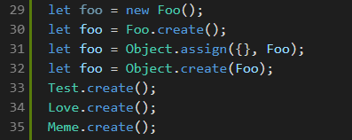

# Learn Game Development JS to TS typings Compiler and JS Syntax Highlighter.

[](https://marketplace.visualstudio.com/items?itemName=learn-game-development.js-syntax-extension)
[](https://marketplace.visualstudio.com/items?itemName=learn-game-development.js-syntax-extension)
[](https://marketplace.visualstudio.com/items?itemName=learn-game-development.js-syntax-extension)


[](https://github.com/Andrew199617/js-syntax-extension/actions/workflows/tests.yml)

### Use Cases:

- Use typescript checking without needing to convert js files. We don't currently allow you to switch to TS using the extension. This extension is for better autocomplete, type checking, and more using JSDocs.
- Need improved intellisense for JavaScript? You will be able to leverage the typings folder and be able to more easily access types from other classes. This is a huge productivity boost!
- Create Types folder for a NPM module in seconds.
- Maintain OLOO pattern. Using Oloo is optional, you can use functions, classes, or Objects linked to other objects.
- This extension is for someone who prefers using vanilla Javascript with jsdoc over TypeScript.

### Have Issues?
- If it looks like a file is being generated incorrectly check the log file and file an issue on Github. This has high priority for me since i use it for my website.

### Compilation
- There is many ways to create a class in JavaScript, there is no such thing as a 'class' only objects.
- We like to use Object literals and take advantage of the builtin Object.create and Object.assign functions to create classes from the Object literals.
- You can also use class for support with React.
- Provides Quick Fix and Code Actions for fixing JS for TS export.

### Syntax
- Provide syntax highlighting for scenarios we encounter a lot in our codebase.
- This allows us to easily know what is going on in a file and avoid errors with naming.
- Things like proptypes and defaultProps gets used very often so its a good idea to have syntax highlighting for these keywords.

### Other Extensions:
- JS/React Snippet Extension

# Features

## Compile .js file into .ts file automagically. Read below to use!

Search for commands under LGD ctrl+shift+P. You can call the command "Compile js file into ts file" or turn generateTypings setting to true.

The .ts file will be placed into the typings folder in your root directory. This is here vscode looks for typings.
- You need to have a jsconfig or tsconfig for vscode to pick up your typings automatically.
- The auto-compile is sensitive to tab size. It picks up your tab size from editor.tabSize. It is highly recommended that you use ESLINT with indent set to error.
- You have to use Stroustrup or Allman style brackets.
### Make sure you set your @type tag correctly.
- We will generate a interface like {classname}Type. Add @type {{classname}Type} to the object literal.

### Auto Compile


### Compile propTypes for Functional Components into an interface.
``` js
import React from 'react';
import Proptypes from 'prop-types';

/**
* @description
* @param {TestProps} props
*/
function Test(props) {
  return (
    <h1>
      Functional component. We'll generate an interface for your props.
    </h1>
  );
}

// This will be compiled into an interface called TestProps.
Test.propTypes = {
  /**
   * @description leave a description here.
   * @type {string}
   */
  test: Proptypes.string
};

export default Test;

///
/// File in typings/**/Test.d.ts
///

declare interface TestProps {
	static test: string;
};

```

### Maintain Hierarchy


### Highlight Foo.create() like new Foo().



### Code highlighting for comments with issues in them. A comment with an issue contains a #[0-9]


### React & Next


# Change Color

## Change the color using these in your settings

``` json
"editor.tokenColorCustomizations": {
    "textMateRules": [
        {
            "scope": "comment.todo",
            "settings": {
                "foreground": "#EE82EE"
            }
        },
        {
            "scope": "comment.issue",
            "settings": {
                "foreground": "#5555EE"
            }
        },
        {
            "scope": "variable.react",
            "settings": {
                "foreground": "#9370DB"
            }
        },
        {
            "scope": "variable.next",
            "settings": {
                "foreground": "#9370DB"
            }
        }
    ]
},
```

## All Scopes

- comment.issue
- comment.todo
- variable.next
- variable.react
- keyword.create

# Settings

``` json
{
  // new in vscode, this will overwrite the syntax highlighting of this extension.
  "editor.semanticHighlighting.enabled": false,

  "lgd.options": {

    // This extension will provide autocomplete/snippets when
    // you start typing certain words.
    "autoComplete" : {
      // Should we autocomplete.
      "enabled" : true
    },

    // Generate typescript file whenever you save a JS f=File.
    "generateTypings": true,

    // Generate typescript file whenever you change a JS File.
    "generateTypingsOnChange": true,

    // Place typescript in folder that relates to JS file in typings folder.
    "maintainHierarchy": true,

    // Whether to write debug info to file in Typings folder.
    // Also determines if you are notified about debug log.
    "createDebugLog": true,

    // If we extract props and state you will be able to use it later if you want to use it as a Template
    // Can also be used for inheriting a class.
    // Extracted interface will be ClassNameProps & ClassNameState.
    "extractPropsAndState": true
  }
}
```

# Goals for 2020

- ~~Auto Compile whole project into typings folder.~~
- ~~Auto Compile React Class.~~
- ~~AutoComplete for React Proptypes.~~ https://www.learngamedevelopment.net/blog/reactpropsintellisense-autocomplete
- Classes with Type at the end need to show as error.
- ~~Save Enum as ts enum.~~
- ~~File rename updates typings file.~~
- ~~Parse return for methods.~~
- Allow the compilation of the whole project into actual TS files not just interfaces.
  - This will allow a user to migrate their entire JS project to TS if they desire.
- Make it so Static Variables only show as an option when you are calling them without using the 'this' keyword. Using class keyword in ts file gets us half the way there.
- checkJs should not cause any issues on our end.

# Known Issues

~~Everything is thrown in the typings folder.~~

~~We need to add option to keep directory structure in typings folder.~~

Function is not created correctly when initialized inside of create and constructor.

Array of Array does not generate type properly defaults to any[].

Manual Adding of Class type.

- Extension samples for adding to this extension. https://github.com/microsoft/vscode-extension-samples/tree/86df3b9422c7fb0987f2f7bc05235875b981b000

# Release Notes

## V2

## 2.4.0

- Parsing propTypes for React Components and React objects not using ES6.
- see changelog.

## 2.3.0

- Added First Quick Fix, more to come.
- see changelog.

### 2.2.6 - 2.2.7

- Added notification to check log. Disabled if createDebugLog is false.
- Added support for getter and setters in Object Literal.

### 2.2.3 - 2.2.5

- Added ability to compile every js file in your project.
- Improved Error Reporting and logging.
- Auto Compile React Class.
- Nested Objects. Very useful for Creating the state object in React.

### 2.2.0 - 2.2.1

- Added the ability to compile on change.
- Improved Error reporting. Specify exact line error and warnings occur on for you to easily fix.
- Logging Errors that occure that aren't breaking to a log file in typings folder.

### 2.1.1 - 2.1.5

- Added maintainHierarchy to settings.
- Improved parsing of create method.

### 2.1.0

- Compile to js to ts now working with inline array.
- Add static keyword.
- Problems being shown for you to fix.
- Create method being parsed for non static variables.

### 2.0.5 - 2.0.6

- Command works now even if you dont have generateTypings set.
- Fixed typed file. interface needs to have a different name than the object for vscode to pick up.

### 2.0.3 - 2.0.4

- Add async and prevent breaking on nested functions
- Add ability to parse defaultValue in function paramaters.

### 2.0.0 - 2.0.2

- Compile a js file into a .d.ts file.
  - This will allow you to have intellisense throughout the whole project.
  - Activate auto compile with settings.

## V1

### 1.1.3 - 1.1.5

- Add highlighting for react keywords. proptypes, and defaultProptypes.
- Add highlighting for next keyword. getInitialProps.

### 1.1.1 - 1.1.2

- Fixed bug where create whould highlight in object literal comments.

### 1.1.0

- Added assign highlighting like create
- Treating Capital Object Literals like a class.

### 1.0.3 - 1.0.6

- Added TODO syntax highlight.
  - scopename: comment.todo.js
- Added Issue comment highlight.
  - scopename: comment.issue.js

### 1.0.0-1.02

Initial release
- Added foo.create syntax highlighting.
