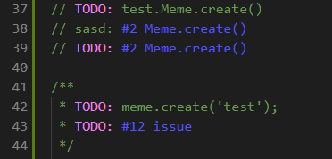

# js-syntax README

Provide syntax highlighting for scenarios we encounter a lot in our codebase.

## Features

Highlight Foo.create() like new Foo(). 

code highlighting for comments with issues in them.
A comment with an issue contains a #[0-9]

Change the color using these in your settings

  "editor.tokenColorCustomizations": {
      "textMateRules": [
          {
              "scope": "comment.todo",
              "settings": {
                  "foreground": "#EE82EE"
              }
          },
          {
              "scope": "comment.issue",
              "settings": {
                  "foreground": "#5555EE"
              }
          }
      ]
  }

## Requirements

None

## Extension Settings

None

## Known Issues

## Release Notes

### 1.0.3 - 1.0.6

- Added TODO syntax highlight.
  - scopename: comment.todo.js
- Added Issue comment highlight.
  - scopename: comment.issue.js

### 1.0.0-1.02

Initial release
- Added foo.create syntax highlighting.
